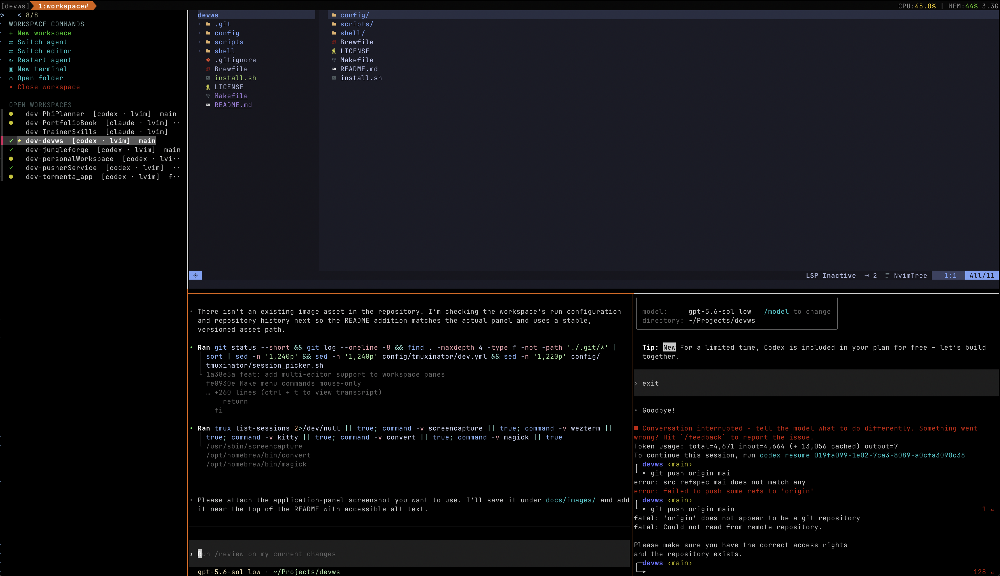

# devws

`devws` turns a project folder into a persistent terminal workspace with:

- a full-height workspace switcher and command menu;
- an editor pane (LunarVim, Neovim, Vim, VS Code, or Zed);
- a Claude Code or Codex agent pane;
- a regular terminal pane;
- Git branch and clean/dirty status in the workspace list.

Each project runs in its own tmux session. The menu can create, switch, and
close workspaces; switch or restart the agent; switch the editor; create
terminals; initialize project instructions for the active agent; and open the
project in Finder, Zed, or VS Code.



Keyboard selection is limited to workspace rows. The command header is
mouse-driven: click a command once to run it.

## Requirements

The automatic dependency installer supports macOS and Linux systems with
[Homebrew](https://brew.sh).

Core dependencies:

- Bash and Zsh
- Git
- tmux 3.2 or newer
- tmuxinator
- fzf
- Glow
- Neovim and LunarVim
- `tree`
- Ruby (used by tmuxinator)
- one AI agent: [Claude Code](https://docs.anthropic.com/en/docs/claude-code)
  or [Codex](https://developers.openai.com/codex/)

The included tmux theme uses
`JetBrainsMono Nerd Font Mono`. The Brewfile installs the font on macOS, but
you must select it in your terminal profile.

Optional GUI integrations are Finder (macOS), Zed, and VS Code. The menu hides
no errors if Zed or VS Code is unavailable; those actions simply do nothing.

Vim, Neovim, VS Code, and Zed are optional alternate editors. Only LunarVim is
installed by the dependency installer; picking another editor requires it to
already be on `PATH`.

### Shift+Enter in iTerm2

iTerm2 sends a plain carriage return for both Enter and Shift+Enter, so nothing
downstream — shell, tmux, or agent — can tell them apart, and Shift+Enter
submits instead of inserting a newline. The installer offers to fix this, or
run it on its own:

```sh
./install.sh --iterm-keys   # or: make install-iterm-keys
```

**Quit iTerm2 first.** It keeps its preferences in memory and rewrites them on
quit, which would discard the change. Reopen iTerm2 afterwards to pick it up.

The mapping sends `ESC CR` (hex `0x1b 0x0d`, the same bytes as Option+Enter) for
Shift+Enter, added to iTerm2's global key map alongside its built-in bindings. If
an agent ignores it, `scripts/setup_iterm_keys.sh` documents two alternatives at
the top: `0x0a` (Ctrl-J) and the CSI-u sequence `[13;2u`. `delete.sh` removes the
mapping again.

## Install

Clone the repository, then run:

```sh
./install.sh --deps
source ~/.zshrc
```

`fzf` is required for the workspace picker and is checked on every install. If
it is missing, the installer asks permission before installing it with
Homebrew and stops without changing configuration when permission is denied.

Every install upgrades an outdated Homebrew-managed tmuxinator automatically.
A tmuxinator installed by another package manager is left unchanged. `--deps`
installs the Brewfile, LunarVim, and tmux plugin manager. If your other
dependencies are already installed, use `./install.sh`.

The installer creates symlinks into the clone. Keep the cloned folder in its
original location after installation. Existing managed files are moved to a
timestamped directory under `~/.devws-backups/` before replacement.

When installation finishes, run the highlighted reload command it prints:

```sh
source ~/.zshrc
```

Install either Codex or Claude Code separately, authenticate it, and edit
`config/tmuxinator/.env` if you want to change the available/default agent or
editor.

## Use

Start a workspace with the interactive agent and editor picker:

```sh
devws ~/Projects/my-app
```

Choose an agent and editor directly:

```sh
devws ~/Projects/my-app codex nvim
devws ~/Projects/my-app claude lvim
```

Control the left workspace menu from any pane:

```sh
devws menu open
devws menu close
devws menu toggle
```

Target another open workspace by folder/session name:

```sh
devws menu open my-app
```

Inside LunarVim, its separate file explorer can be controlled with
`:NvimTreeOpen`, `:NvimTreeClose`, or `:NvimTreeToggle`.

### Session persistence

Open workspaces are saved automatically, so a reboot or an iTerm2/tmux crash
does not cost you the arrangement. Saved per workspace:

- the workspace folder, agent, and editor
- the pane layout and each pane's working directory
- extra terminals created from the workspace menu
- whether the workspace menu was open or closed

State lives in `~/.devws-state/sessions.tsv` and is rewritten whenever a
workspace is created or closed, a client detaches, the agent or editor is
swapped, a terminal is added, or the menu is toggled.

The first `devws` run that finds no tmux server reopens the saved workspaces
before starting the one you asked for, then attaches you to it. Restore and
save can also be driven by hand:

```sh
devws restore              # reopen the saved workspaces and attach
devws restore --no-attach  # reopen them in the background
devws save                 # snapshot the current workspaces now
devws fresh                # forget the saved workspaces
```

Set `DEVWS_AUTO_RESTORE=0` in `config/tmuxinator/.env` to turn the automatic
restore off and keep only the explicit commands.

Three limits are worth knowing: a workspace whose folder no longer exists is
skipped with a message; an agent or editor that is no longer listed in
`.env` falls back to the configured default; and programs other than the agent
and the editor are not restarted — restored terminals come back at a shell
prompt in their saved directory.

### Initialize an agent

Click **Initialize agent** in the workspace menu to seed the current project
for the workspace's active agent:

- Claude creates `CLAUDE.md` and `.claude/skills/`.
- Codex creates `AGENTS.md` and `.agents/skills/`.

The shared template includes reusable TDD, SOLID, naming, simplicity, testing,
and planning rules. Existing instruction files and skills are never
overwritten.

## Markdown preview

Open a Markdown file with Glow:

```sh
devws md README.md
```

Run the command without a path to choose a `.md` or `.markdown` file below the
current directory with `fzf`:

```sh
devws md
```

Inside LunarVim, press `<leader>mp` while editing a Markdown file. Modified
files are saved before Glow opens in a temporary terminal split; exiting Glow
closes that split.

Glow is installed by `./install.sh --deps` through Homebrew on macOS and
Linux. Both entry points report how to install it when it is unavailable.

Glow renders Markdown as terminal text, so it cannot draw Mermaid diagrams —
a ```` ```mermaid ```` fence shows up as plain code. When a file contains one,
both entry points additionally open a rendered preview in your default
browser (`open` on macOS, `xdg-open` on Linux) alongside the Glow preview.
That preview loads its Markdown/Mermaid renderer from a CDN, so it requires
internet access; files without a Mermaid fence are unaffected and only use
Glow, exactly as before.

## Menu indicators

- A dark gray background marks the active workspace.
- A lighter opaque gray background marks the selected workspace.
- Yellow `●` means the Git working tree has uncommitted or untracked changes.
- Green `✓` means the Git working tree is clean.

## Configuration

- Agents and editors, automatic restore: `config/tmuxinator/.env`
- Saved workspaces: `~/.devws-state/sessions.tsv`
- iTerm2 Shift+Enter mapping: `scripts/setup_iterm_keys.sh`
- Workspace layout: `config/tmuxinator/dev.yml`
- Workspace menu: `config/tmuxinator/session_picker.sh`
- LunarVim: `config/lvim/config.lua`
- tmux: `config/tmux/tmux.conf`
- Shell command and prompt: `shell/devws.zsh`
- Mermaid diagram preview: `shell/render_mermaid_preview.sh`

After changing a symlinked config, restart the relevant program. Reload shell
changes with `source ~/.zshrc`; reload tmux with
`tmux source-file ~/.tmux.conf`.

## Validate

```sh
make check
```

This checks Bash/Zsh syntax, the tmuxinator ERB/YAML template, Lua syntax when
`luac` is available, and executable permissions.

## Uninstall

Run:

```sh
./delete.sh
source ~/.zshrc
```

During installation, devws records its backup state before replacing any
configuration. The uninstall script removes the configuration symlinks
created by this checkout, restores the files that were in their place before
installation, and removes the shell integration from `~/.zshrc`.

The saved workspace state in `~/.devws-state/` is removed, and the iTerm2
Shift+Enter mapping is deleted when devws is the one that added it. Quit iTerm2
before uninstalling so that removal can take effect.

Files that are no longer devws-managed are left untouched. If one conflicts
with a configuration that needs to be restored, the previous configuration
remains in `~/.devws-backups/` and the script reports its location. Only empty
configuration directories are removed.

If devws installed `fzf` after receiving permission or installed Glow through
`./install.sh --deps`, `delete.sh` removes those owned packages. Pre-existing
installations are never removed. Other dependencies installed with `--deps`
are preserved because Homebrew packages, LunarVim, and tmux plugin manager may
be shared with other tools or may have existed before devws. Remove those
separately only if they are no longer needed.

The installer and uninstaller never modify Git remotes or GitHub
configuration.
